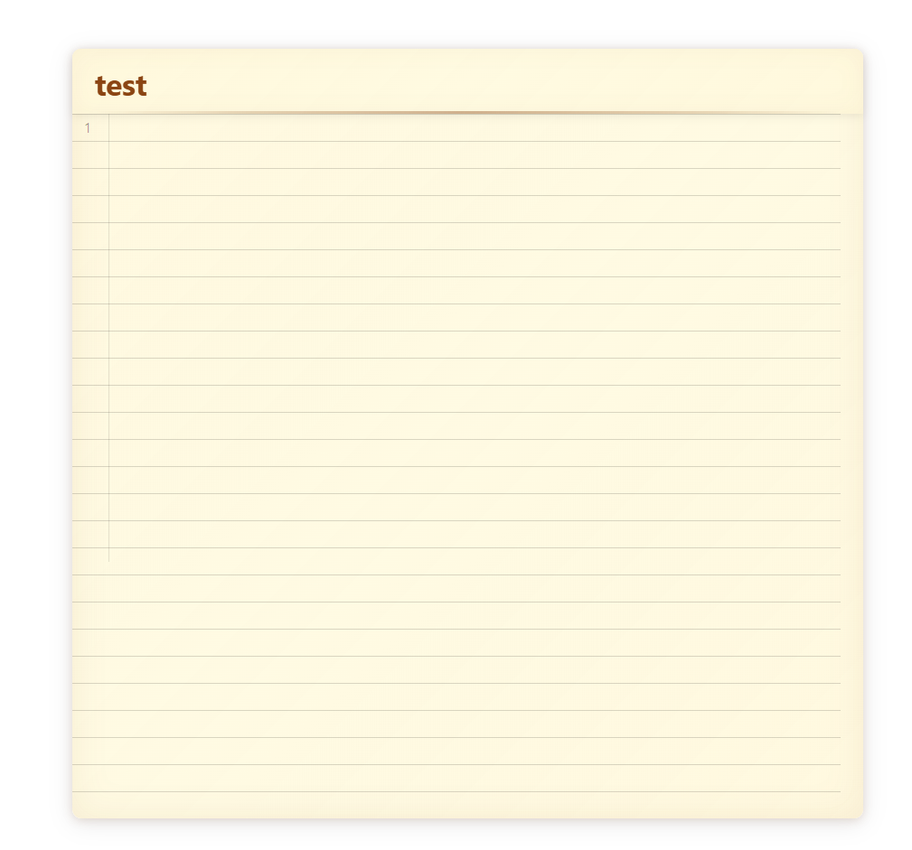
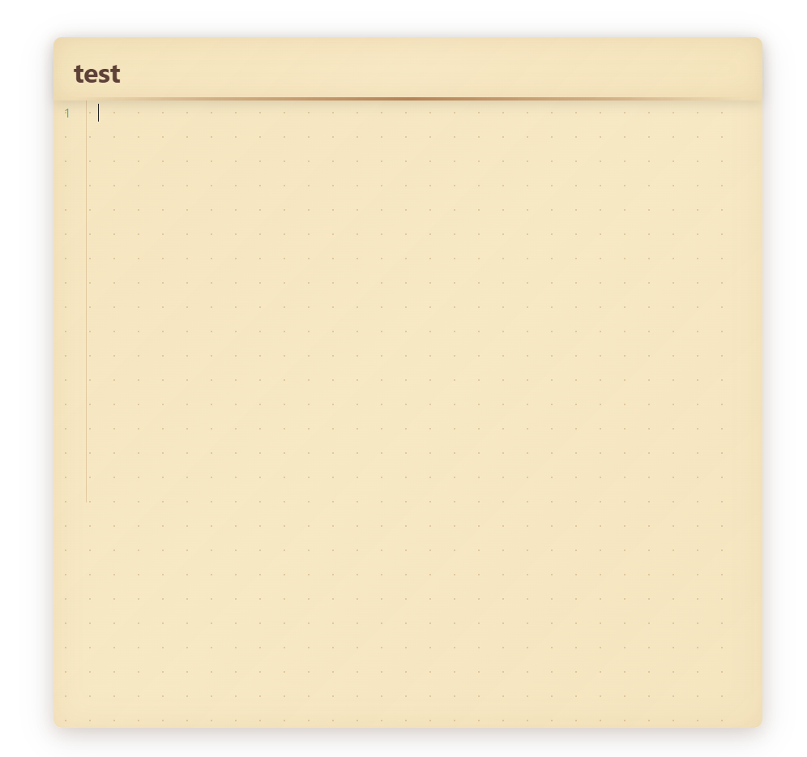
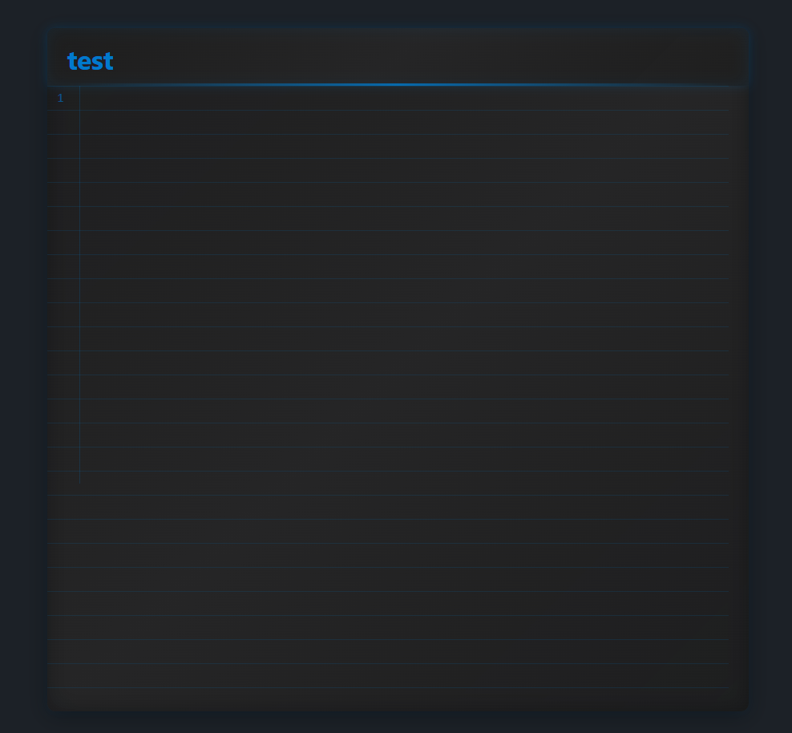
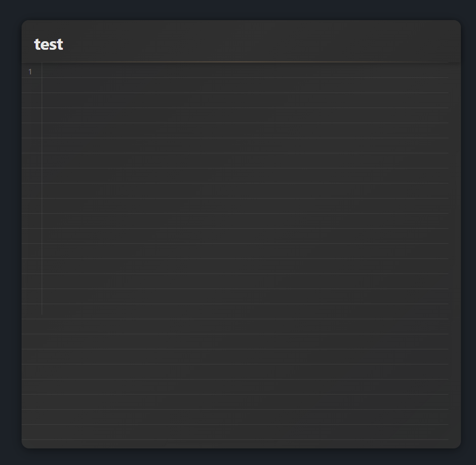

# Obsidian Editor Themes / Obsidian 编辑器主题集

[English](#english) | [中文](#chinese)

---

## English

A collection of beautiful themes for Obsidian editor with grid lines and background effects. Transform your note-taking experience with elegant visual enhancements.

### ✨ Features

- 🎨 **Multiple Visual Themes** - VS Code, Notion, Apple Notes, and more
- 📏 **Grid Line Patterns** - Dotted, dashed, horizontal lines with various styles
- 🌙 **Dark/Light Theme Support** - Automatic theme switching
- 📱 **Responsive Design** - Optimized for desktop and mobile
- 🎯 **Easy Installation** - Simple CSS snippets setup
- 🔧 **Highly Customizable** - Easy to modify and extend

### 🎨 Themes Included

#### Grid Line Themes
- **VS Code Style Grid Lines** - Professional programming aesthetic
- **Notion Style Grid Lines** - Clean and minimal design
- **Classic Horizontal Grid** - Traditional lined paper look
- **Dotted Grid** - Retro dotted pattern
- **Dashed Grid** - Modern dashed lines
- **Leaf Vein Grid** - Natural forest-inspired pattern
- **Colorful Gradient Lines** - Vibrant gradient effects

#### Background Themes
- **Apple Notes Style Background** - Clean and elegant
- **Notion Minimalist Background** - Modern and simple
- **Typora Elegant Background** - Sophisticated design
- **VS Code Dark Theme Background** - Professional dark mode
- **Vintage Parchment Background** - Classic paper texture
- **Modern Parchment Background** - Contemporary paper style
- **Dark Parchment Background** - Elegant dark paper
- **Morning Forest Background** - Natural and refreshing

#### Card Style Themes
- **Modern Card Style** - Clean card layout
- **Vintage Card Style** - Retro card design
- **Gradient Color Card Style** - Colorful gradient cards

### 📸 Preview

### 🚀 Installation

1. **Download** the desired CSS file from this repository
2. **Open** Obsidian Settings → Appearance → CSS snippets
3. **Click** the folder icon to open the snippets folder
4. **Copy** the CSS file to the snippets folder
5. **Enable** the snippet in Obsidian's CSS snippets list

### 📖 Usage

Each theme file can be used independently. Simply enable the CSS snippet in Obsidian's settings to apply the theme. You can also combine multiple themes for custom effects.

### 🛠️ Customization

All themes are built with CSS and can be easily customized:
- Modify colors by changing CSS variables
- Adjust grid spacing by modifying background-size values
- Change fonts by updating font-family properties
- Add new effects by extending the CSS rules

### 🤝 Contributing

We welcome contributions! Feel free to:
- Submit new theme ideas
- Report bugs or issues
- Suggest improvements
- Create pull requests

### 📄 License

MIT License - feel free to use and modify as needed.

---

## Chinese

Obsidian 编辑器主题集合，提供网格线条和背景效果。用优雅的视觉增强来改变您的笔记体验。

### ✨ 功能特性

- 🎨 **多种视觉主题** - VS Code、Notion、Apple Notes 等多种风格
- 📏 **网格线条模式** - 点状、虚线、横线等多种样式
- 🌙 **深色/浅色主题支持** - 自动主题切换
- 📱 **响应式设计** - 桌面和移动端优化
- 🎯 **简单安装** - 简单的 CSS 代码片段设置
- 🔧 **高度可定制** - 易于修改和扩展

### 🎨 包含的主题

#### 网格线条主题
- **VS Code 风格网格线条** - 专业编程美学
- **Notion 风格网格线条** - 简洁极简设计
- **经典横线网格** - 传统横线纸风格
- **点状网格** - 复古点状图案
- **虚线网格** - 现代虚线风格
- **树叶脉络网格** - 自然森林灵感图案
- **彩色渐变横线** - 鲜艳渐变效果

#### 背景主题
- **Apple Notes 风格背景** - 简洁优雅
- **Notion 简约背景** - 现代简约
- **Typora 优雅背景** - 精致设计
- **VS Code 深色主题背景** - 专业深色模式
- **复古羊皮纸背景** - 经典纸张纹理
- **现代羊皮纸背景** - 当代纸张风格
- **深色羊皮纸背景** - 优雅深色纸张
- **晨光森林背景** - 自然清新

#### 卡片风格主题
- **现代卡片风格** - 简洁卡片布局
- **复古卡片风格** - 复古卡片设计
- **渐变彩色卡片风格** - 彩色渐变卡片

### 📸 预览效果

### 🚀 安装方法

1. **下载** 从本仓库下载所需的 CSS 文件
2. **打开** Obsidian 设置 → 外观 → CSS 代码片段
3. **点击** 文件夹图标打开代码片段文件夹
4. **复制** CSS 文件到代码片段文件夹
5. **启用** Obsidian CSS 代码片段列表中的代码片段

### 📖 使用方法

每个主题文件都可以独立使用。只需在 Obsidian 设置中启用 CSS 代码片段即可应用主题。您也可以组合多个主题来创建自定义效果。

### 🛠️ 自定义

所有主题都是用 CSS 构建的，可以轻松自定义：
- 通过更改 CSS 变量来修改颜色
- 通过修改 background-size 值来调整网格间距
- 通过更新 font-family 属性来更改字体
- 通过扩展 CSS 规则来添加新效果

### 🤝 贡献

我们欢迎贡献！请随时：
- 提交新主题想法
- 报告错误或问题
- 提出改进建议
- 创建拉取请求

### 📄 许可证

MIT 许可证 - 可自由使用和修改。

---

## 📞 Contact / 联系方式

- **GitHub Issues**: [Create an issue](https://github.com/your-username/obsidian-editor-themes/issues)
- **Email**: your-email@example.com

---

*Made with ❤️ for the Obsidian community*
*为 Obsidian 社区用心制作* 